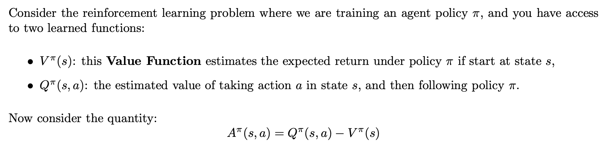
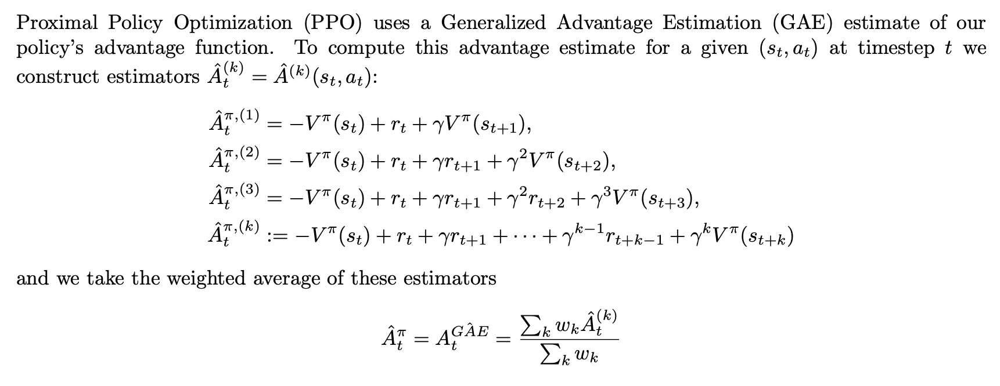
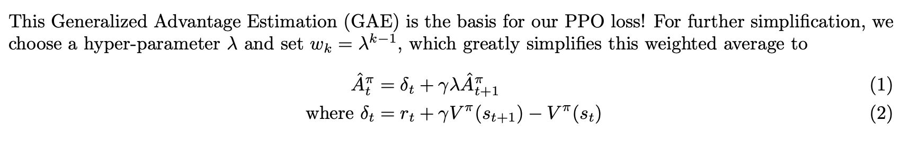
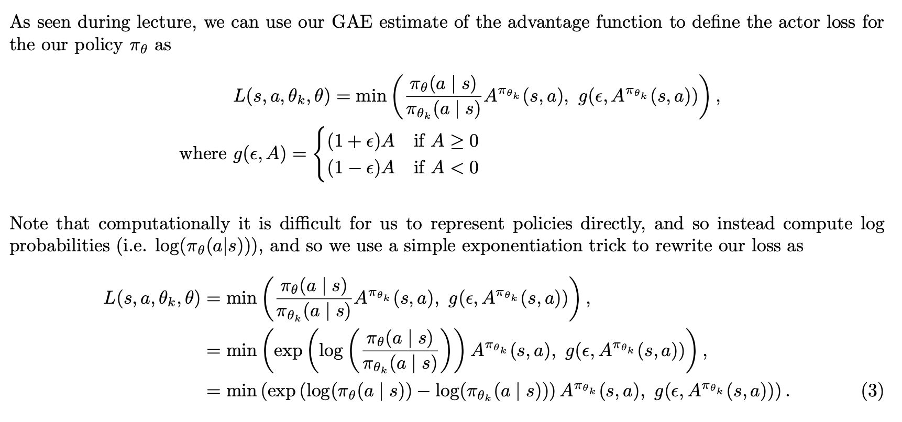
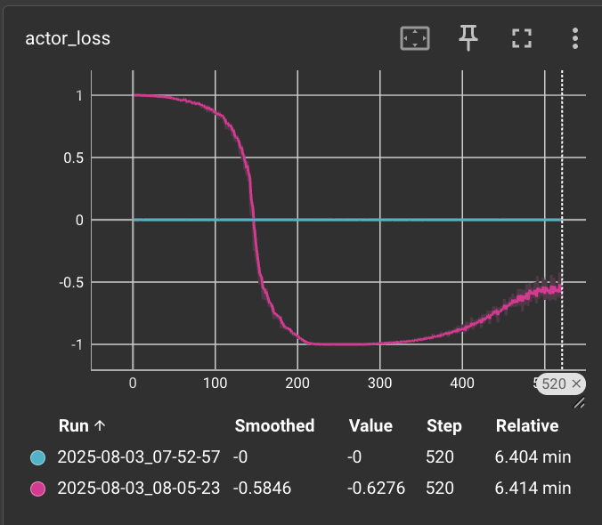
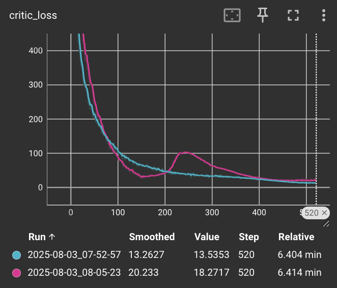

# BAIR-NCKU 2025 Summer – Week 4 Assignment

**Date:** 2025/07/31  
**Email:**  shanuuuu90@gmail.com

---

## 1. Generalized Advantage Estimation


### A. What does this difference represent, intuitively? Why might $A^{\pi_\theta}(s, a)$ be called the "Advantage Function"?

<em>
Answer:

The difference $A^{\pi}(s, a) = Q^{\pi}(s, a) - V^{\pi}(s)$ 
represents how much better or worse taking action $a$ is compared to the average performance of the current policy in state $s$.

It's called the **"Advantage Function"** because it quantifies the advantage of choosing a specific action over what the policy would typically do.

</em>

### B. Suppose you sample from a policy $\pi_\theta$, and find that $A^{\pi}(s, a) \geq 0$. What does this tell you about the action $a$ relative to your current policy? What about when $A^{\pi}(s, a) < 0$?

<em> 
Answer:

- $A^{\pi}(s, a) > 0$: Action $a$ is **better** han expected, and should be reinforced.  
- $A^{\pi}(s, a) < 0$: Action $a$ is **worse** than expected, and should be discouraged.  
- $A^{\pi}(s, a) = 0$: Action $a$ performs **at the expected level**
</em>




### C. How does the bias and variance of the $\hat{A}^{\pi, (1)}_t$ estimate compare with the bias and variance of the $\hat{A}^{\pi, (\infty)}_t$ estimate?

<em>
Answer:

$$
\hat{A}_t^{\pi, (1)} = -V^{\pi}(s_t) + r_t + \gamma V^{\pi}(s_{t+1})
$$

- **Lower** variance (uses only one reward $r_t$)
- **Higher** bias (relies on potentially inaccurate $\gamma V^{\pi}(s_{t+1})$)

$$
\hat{A}_t^{\pi, (k)} := -V^{\pi}(s_t) + r_t + \gamma r_{t+1} + \cdots + \gamma^{k-1} r_{t+k-1} + \gamma^k V^{\pi}(s_{t+k})
$$
- **Higher** variance (accumulates noise from all future rewards)
- **Lower** bias (uses actual returns, no bootstrapping)

</em>

### D. Implement the formula for the GAE calulation seen in Eqn. 1 as python code inside the `_get_advantages(gae_and_next_value, transition)` function found in our starter code. Please attach a copy of your function implementation to your submission.

```python
def _get_advantages(gae_and_next_value, transition) -> Tuple[Tuple[jax.Array, jax.Array], jax.Array]:
    gae, next_value = gae_and_next_value
    done, value, reward = (transition.done, transition.value, transition.reward,)
    gamma = config["GAMMA"] * (1 - done)  
    gae_lambda = config["GAE_LAMBDA"]

    delta = reward + gamma * next_value - value

    gae = delta + gamma * gae_lambda * gae

    return (gae, value), gae
                    
```

---
## 2. Calculating Actor Loss


### A. Note that it is common to normalize our GAE estimates before performing this loss calculation via $$A_t^{\pi} = \frac{\hat{A}_t^{\pi} - \text{mean}(\hat{A}_t^{\pi})}{\text{std\_dev}(\hat{A}_t^{\pi})}.$$ Why would this help our loss calculations?

<em>
Answer: Normalizing advantage values to zero mean and unit variance ensures consistent update scales across samples, reducing sensitivity to outliers and improving policy learning stability.
</em>


### B. Implement the actor loss shown in Eqn. 3 within the `_loss_actor(log_prob, log_prob_k, normalized_gae, clip_epsilon)` function in our starter code. Please attach a copy of your function implementation to your submission.

```python
def _loss_actor(log_prob, log_prob_k, normalized_gae, clip_epsilon):
    ratio = jnp.exp(log_prob - log_prob_k)
    clipped_ratio = jnp.clip(ratio, 1 - clip_epsilon, 1 + clip_epsilon)
    loss_actor = -jnp.minimum(ratio * normalized_gae, clipped_ratio * normalized_gae).mean()

    return loss_actor, ratio
```
---
## 3. Training

| Actor loss | Critic loss |
|----------|-----------|
|||

[blue line]: original ppo policy
* actor loss shows almost no learning signal (values close to 0)
* critic loss maintains good downward trend

[red line]: change gae normalization
* Changed from `gae = (gae - gae.mean()) / (gae.std() + 1e-8)` to `gae = gae / (jnp.abs(gae).mean() + 1e-8)`
* actor loss values recovered to normal range (-1.0 to 1.0), showing healthy learning curve
* Original method causes numerical instability when std() is small, new method using absolute mean as denominator is more stable